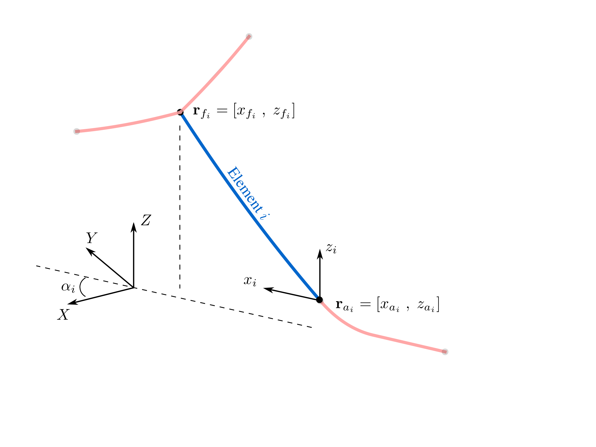
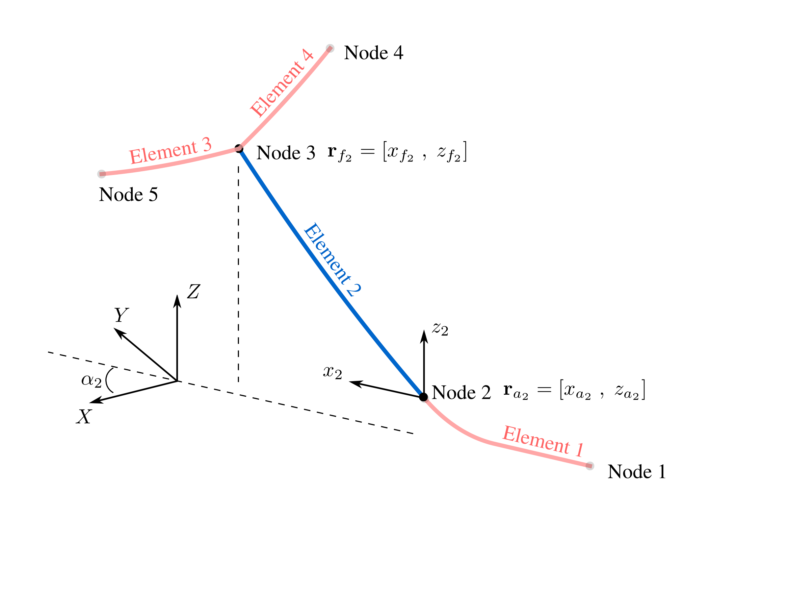
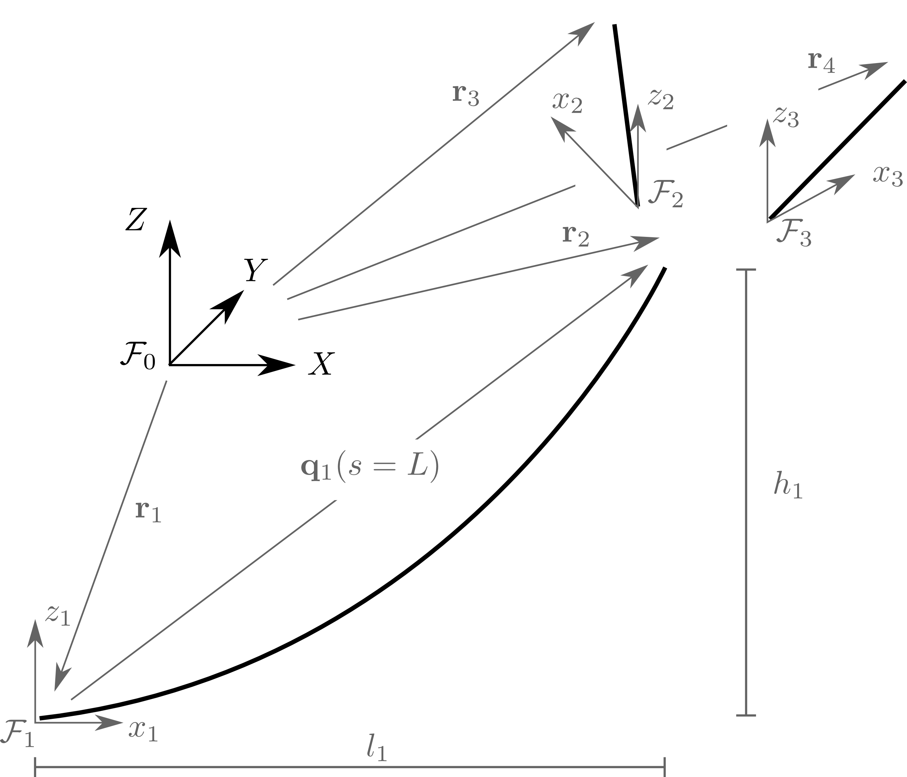
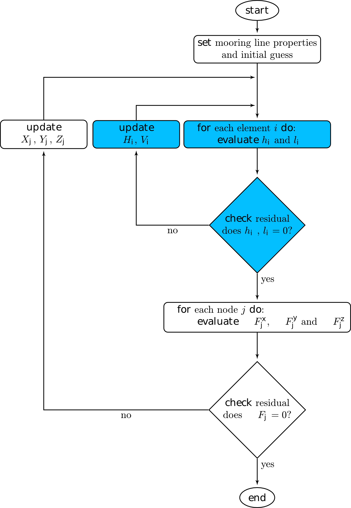
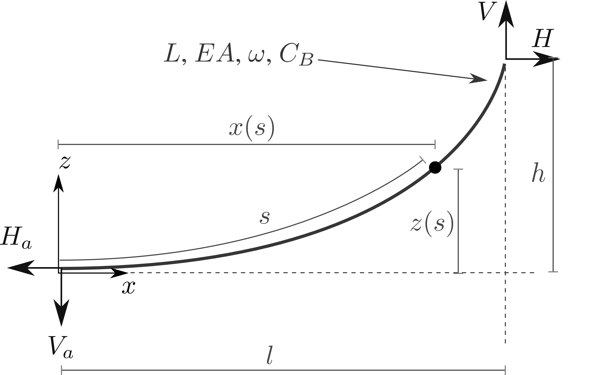
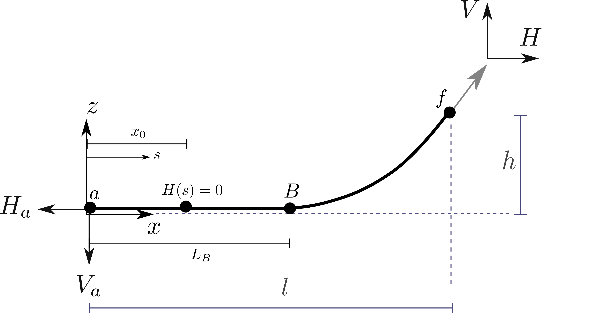

Definitions
===========

What MAP++ Solves
-----------------

Mooring models can be classified into two groups: static models and dynamic models. 
Static models ignore the inertia forces and fluid drag loads, and only account for the mean forces in the mooring system, including elasticity, weight (in fluid), and geometric nonlinearities. 
Static models are the type concerned in MAP++. 
Extra steps are taken to reformulate the classic single line, closed--form solution :cite:`irvine1992` into a piece-wise, multi-sgemented system.
This piece wise system is composed of a collection of nodes and elements.

Each element in the figure above is expressed as a single line counterpart in the image below in two configurations. 
One configuration has the line hanging freely, whereas the second orientation account for friction and contact at the bottom boundary. 

Nomenclature
------------

=============  ===============================================================  ============
**Variable**   **Definition**                                                   **Units**
:math:`A`      Cable cross-sectional area                                       [m^2]
:math:`C_B`    Seabed contact friction coefficient                              --
:math:`E`      Young's modulus                                                  [N/m^2]
:math:`g`      Acceleration due to gravity                                      [m/s^2]
:math:`h`      Vertical fairlead excursion                                      [m]
:math:`H`      Horizontal fairlead force                                        [N]
:math:`H_a`    Horizontal anchor force                                          [N]            
:math:`l`      Horizontal fairlead excursion                                    [m]
:math:`L`      Unstretched line length                                          [m]
:math:`L_B`    Line length resting on the seabed                                [m]
:math:`M_j`    Point mass applied to the jth node                               [kg]
:math:`r_i`    Node position vector [xi ; yi ; zi]                              [m]
:math:`s`      Unstretched distance from the anchor (:math:`0 \leq s \leq  L`)  [m]
:math:`T_i`    Cable tension vector                                             [N]
:math:`Te(s)`  Cable tangential tension at distance s                           [N]
:math:`V`      Vertical fairlead force                                          [N]
:math:`V_a`    Vertical anchor force                                            [N]
:math:`x_0`    Horizontal force transition point for :math:`H(s)>0`             [N]                
:math:`R_i`    Rotation angle between the :math:`x_i` and :math:`X` axis        --
:math:`\rho`   Fluid density                                                    [kg/m^3]
=============  ===============================================================  ============

Theory
------
The solution process begins by evaluating the two continuous analytical catenary equations for each element based on :math:`l` and :math:`h` values obtained through node displacement relationships. 
An element is defined as the component connecting two adjacent nodes together. 
Once the element fairlead (:math:`H`, :math:`V` ) and anchor (:math:`H_a`, :math:`Va`) values are known at the element level, the forces are transformed from the local :math:`x_i z_i` frame into the global :math:`XYZ` coordinate system. 
The force contribution at each element's anchor and fairlead is added to the corresponding node it attaches to. 

The force-balance equation is evaluated for each node, as follows:

.. math::
   \left \{ \mathbf{F} \right \}_{X}^{j} = \sum^{\textup{Elements $i$ at Node } j}_{i=1} \left [ H_{i}\cos(\alpha_{i}) \right ]-F_{X_{j}}^{ext} =0
  
   \left \{ \mathbf{F} \right \}_{Y}^{j} = \sum^{\textup{Elements $i$ at Node } j}_{i=1} \left [ H_{i}\sin(\alpha_{i}) \right ]-F_{Y_{j}}^{ext} =0
  
   \left \{ \mathbf{F} \right \}_{Z}^{j} = \sum^{\textup{Elements $i$ at Node } j}_{i=1} \left [ V_{i} \right ]-F_{Z_{j}}^{ext} + M_{j}g - \rho g B_{j} =0

Node forces are found based on the connectivity geometry between lines and external forces applied at the boundary conditions. 
This :ref:`is initiated by defining a series <exploded_3d>` of :math:`\mathcal{F}_i` local frames at the origin in which the individual lines are expressed in. 
Frame :math:`\mathcal{F}_0` is an arbitrary global axis, but it is usually observed as the vessel reference origin.

.. _exploded_3d:

.. centered:: Exploded 3D multisegemented line with local :math:`xyz` and global :math:`XYZ` reference origins. The fairlead and anchor positions are denoted by vector :math:`\mathbf{r}_i`.

.. Note::
   Simplistic way to think of MAP's dichotomy between nodes and elements:
   Nodes define the force at connection points. 
   Elements define the mooring geometry.

Clearly, this process requires two distinct sets of equations, one of which must be solved within the other routine, to find the static cable configuration. 
The first set of equations are the force{balance relationships in three directions for each node; the second set of equations are the catenary functions proportional to the number of lines. 
Interactions between solves is captured in the :ref:`flowchart below to summarize the solve solve procedure <nested_flow>`. This method was first proposed in :cite:`pevrot1979`.

.. _nested_flow:

.. centered:: no cpation yet

Single Line
~~~~~~~~~~~

.. centered:: Single line definitions for a hanging catenary

		     
Single Line with Contact
~~~~~~~~~~~~~~~~~~~~~~~~

.. centered:: Single line definitions for a catenary touching a bottom boundary with friction.
