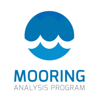
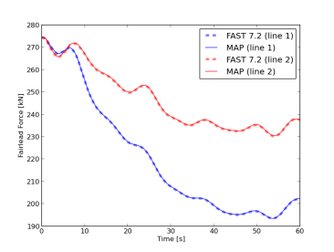

MAP++ Documentation
===================

.. toctree::
   :maxdepth: 2
   :hidden:

   notes.rst
   definitions.rst
   theory.rst
   input_file.rst
   python_example.rst
   modules
   help.rst
   ref.rst

The Mooring Analysis Program is a software library to model underwater cables held in static equilibrium. 
MAP++ is designed to hook into other simulation codes as a tool for prototyping designs, designating a force-diplacements relationship for an arrangement, or include into other dynamic simulation codes to obtain the nonlinear restoring force.
This program has been tested on Windows, Linux, and OSx platforms interfacing into program written Python, C, C++, and Fortran. 
MAP++ follows the FAST Offshore Wind Turbine Framework :cite:`jonkman2013new` software pattern.

More information on the theory behind MAP++ is described :cite:`masciola2013`, with the hopes to extend capabilities to include a heuristic finite element formulation as described :cite:`masciola2014`. MAP++ is licensed under Apache version 2.

