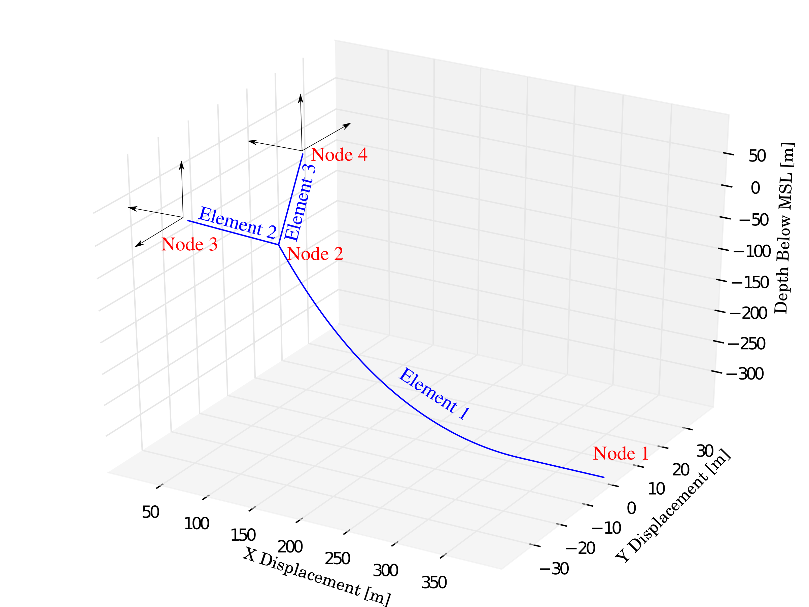

Input File
==========

A MAP input file initializes a mooring mode to provide essential information regarding the mooring line properties, declaring the number of nodes and lines in the system, association between nodes and lines, boundary conditions, and initial states.
It is recommended to use a ``<*.map>`` extension to identify the MAP input file.
The sample MAP input deck given below::

	--------------- LINE DICTIONARY ----------------------------------------------
	LineType  Diam      MassDenInAir   EA        CB   CIntDamp  Ca    Cdn    Cdt
	(-)       (m)       (kg/m)        (N)        (-)   (Pa-s)   (-)   (-)    (-)
	steel     0.25       319.07     9817477042   1.0   -999.9 -999.9 -999.9 -999.9
	poly      0.30       98.96      989601685    1.0   -999.9 -999.9 -999.9 -999.9
	--------------- NODE PROPERTIES ----------------------------------------------
	Node Type       X       Y       Z      M     B     FX    FY    FZ
	(-)  (-)       (m)     (m)     (m)    (kg)  (mˆ3)  (N)   (N)   (N)
	1    fix     400        0     depth    0     0      #     #     #
	2    connect #90       #0    #-80      0     0      0     0     0   
	3    vessel   20        20    -10      0     0      #     #     #
	4    vessel   20       -20    -10      0     0      #     #     #
	--------------- LINE PROPERTIES ----------------------------------------------
	Line    LineType  UnstrLen  NodeAnch  NodeFair  Flags
	(-)      (-)       (m)       (-)       (-)       (-)
	1       steel      450        1         2  
	2       poly      #90         2         3  
	3       poly      #90         2         4  
	--------------- SOLVER OPTIONS------------------------------------------------
	Option
	(-)

acts as a template for defining parameters in a mooring system demonstrated here: 

The MAP input file is divided into four sections:

* **LINE DICTIONARY:** Defines the material properties of the line.

* **NODE PROPERTIES:** Defines boundary constraints and extensional limits.

* **LINE PROPERTIES:** Associates a line with material properties and connectivity between nodes. 

* **SOLVER OPTIONS:** Run-time options to engage different solve strategies.

Line Dictionary
---------------

Node Properties
---------------

Line Properties
---------------

Solver Options
--------------
